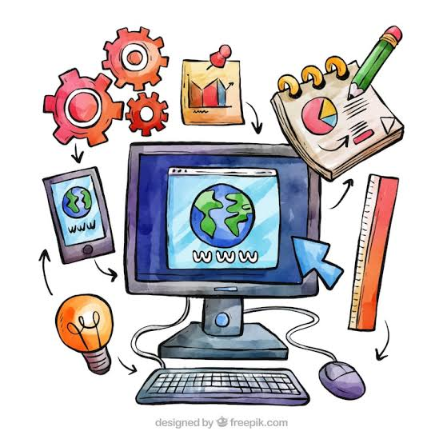

# Introducción a la programación

## ¿Qué es un programa informático?

Un programa informático es un conjunto de instrucciones escritas en un lenguaje que un ordenador puede interpretar y ejecutar, con el objetivo de realizar una tarea concreta. Estas instrucciones indican al hardware qué operaciones debe realizar, en qué orden y bajo qué condiciones, permitiendo que la máquina resuelva problemas, procese datos o interactúe con el usuario.

Un programa no es más que la traducción de un algoritmo (una secuencia lógica de pasos para resolver un problema) a un lenguaje que la máquina, directa o indirectamente, es capaz de entender.

## Diferencia entre código fuente, código objeto y código ejecutable

Durante el proceso de creación de un programa, el código pasa por varias transformaciones antes de poder ejecutarse:

- **Código fuente:** es el conjunto de instrucciones escritas por el programador en un lenguaje de programación (Java, Python, C++, etc.), legible para las personas. Se guarda en archivos de texto plano con la extensión correspondiente al lenguaje (`.java`, `.py`, `.c`...).

- **Código objeto:** es el resultado de traducir el código fuente mediante un compilador a lenguaje máquina, pero todavía no es directamente ejecutable, ya que puede depender de otras partes del programa (funciones, librerías) que aún no se han enlazado entre sí. Suele estar en formato binario y no es legible por humanos.

- **Código ejecutable:** se obtiene tras el proceso de enlazado (*linking*), donde se unen todos los códigos objeto necesarios junto con las librerías externas que el programa utiliza. El resultado es un archivo binario que el sistema operativo puede cargar en memoria y ejecutar directamente (por ejemplo, un `.exe` en Windows).

En resumen, el flujo habitual es: Código fuente → (compilación) → Código objeto → (enlazado) → Código ejecutable

## Etapas del desarrollo del software

El desarrollo de software sigue un ciclo de vida compuesto por varias fases:

1. **Análisis de requisitos:** se identifican y documentan las necesidades del cliente o usuario final, definiendo qué debe hacer el software.

2. **Diseño:** se planifica la arquitectura del sistema, la estructura de los datos, y la interfaz con la que interactuará el usuario, antes de escribir una sola línea de código.

3. **Implementación (codificación):** los desarrolladores escriben el código fuente siguiendo el diseño establecido, en el lenguaje de programación elegido.

4. **Pruebas (testing):** se verifica que el software funcione correctamente, buscando errores (*bugs*) y comprobando que se cumplen los requisitos definidos en la primera fase.

5. **Despliegue (deployment):** el software se pone a disposición de los usuarios finales, ya sea instalándolo, publicándolo en una tienda de aplicaciones o desplegándolo en un servidor.

6. **Mantenimiento:** una vez en producción, el software recibe actualizaciones, correcciones de errores y mejoras a lo largo del tiempo, en función de las necesidades que van surgiendo.

## Repositorio

[1DAMV_Duran_Lopez_Nieves](https://github.com/duran-ni/1DAMV_Duran_Lopez_Nieves)
